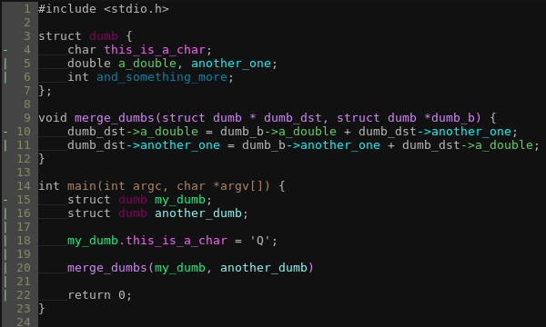
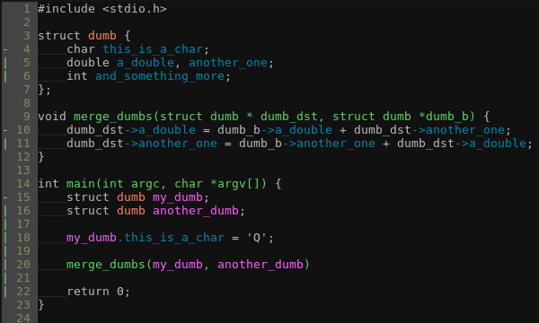

# Colorcode
Inspired by [this post](https://medium.com/programming-ideas-tutorial-and-experience/3a6db2743a1e), this plugin aims to do exactly this. It reads the tags file in your working directory and adds a match for each tag.

## Installation

* Using [Pathogen](https://github.com/tpope/vim-pathogen), run the following commands:

        % cd ~/.vim/bundle
        % git clone https://github.com/ferranpm/vim-colorcode

## Usage

This plugin will only work if tags files are in your working directory.
It only loads if it finds at least one tags file.
After that, each time the file is saved, ctags is called and file gets repainted.

To disable this plugin use `let g:colorcode_enable=0`

## Screenshots

Screenshot of a simple program with `syntax off` and `let g:colorcode_global=0`

...with `let g:colorcode_global=1` option

## ToDo

- [ ] Make it respect other colorschemes
- [ ] Make it work on light backgrounds
- [ ] Make it faster (specially with `g:colorcode_global=0`)
- [ ] Add gvim support
- [ ] Check if a tag is from the same filetype (a python tag should not appear in a vim script)
